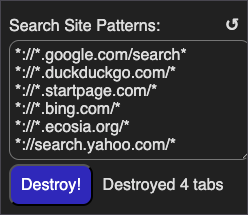

# Search Destroyer  

A Chrome/Chromium browser extension that closes all open tabs from search engines with one click. 

*Currently Under Review at the Chrome Extension Store. In the meantime you can follow instructions below.*



## Features

- Close tabs from multiple search engines (Google, DuckDuckGo, Startpage, Bing, Ecosia, Yahoo)
- Customizable list of URL patterns
- Dark mode support
- Minimal permissions (tabs and storage only)

## Installation

1. Clone or download this repository
2. Open your browser's extensions page:
   - Chrome: `chrome://extensions`
   - Brave: `brave://extensions`
   - Edge: `edge://extensions`
3. Enable **Developer mode** (toggle in top-right)
4. Click **Load unpacked** and select the `search-destroyer` folder

## Usage

1. Click the Search Destroyer icon in your toolbar
2. (Optional) Edit the URL patterns in the text area
3. Click **Destroy!** to close all matching tabs

Click the ↺ icon to reset patterns to defaults.

## URL Pattern Format

Patterns use Chrome's match pattern syntax: `scheme://host/path`

Example: `*://*.google.com/search*` matches any Google search page.

Though originally intended for search sites, you can add other sites such as social media and news. For example, you could edit the list to read:
```
*://*.google.com/search*
*://*.duckduckgo.com/*
*://*.startpage.com/*
*://*.bing.com/*
*://*.ecosia.org/*
*://search.yahoo.com/*
*://*.instagram.com/*
*://*.facebook.com/*
*://*.reddit.com/*
*://*.slashdot.org/*
*://*.fark.com/*
*://*.bsky.app/*
*://*.x.com/*
*://*.twitter.com/*
*://*.linkedin.com/*
```

## Privacy Policy 

- Doesn't use any user data
- Doesn't view or modify any web pages
- Doesn't track or report anything
- Does store list of (customized) URL patterns to standard extension storage

## Human Authorship

This was not vibe-coded, it was me-coded -- with [solveit](https://solve.it.com) AI coaching me every step along the way. ;-)

## License

MIT
